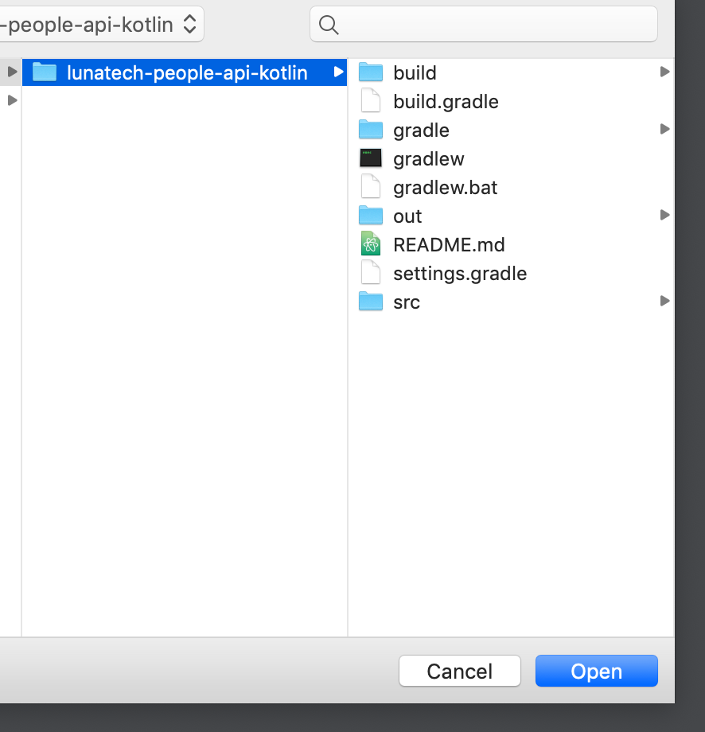

# Lunatech People API in Kotlin

A simple API providing information about Lunatech employees. 
Ported from Scala to Kotlin.

The following operations can be performed on the API:
* Filter People by Property Value
* Filter Fields by Field Name

## Getting Started

These instructions will get you a copy of the project up and running on your local machine for development and testing purposes.

### Prerequisites

* [JDK](https://www.oracle.com/technetwork/java/javase/downloads/jdk11-downloads-5066655.html)      Version 11.0.1
* [INTELLIJ](https://www.jetbrains.com/idea/download) Version 2018.2.5

### Installing

Follow these instructions.

---

Navigate to the directory where this git repo will be cloned

```
cd path/to/directory
```

Clone the git repo

```
git clone https://github.com/lunatech-labs/lunatech-people-api-kotlin.git
```

Click IntelliJ app icon


Click 'Open'


Navigate to the root directory of git repo



Click 'Open'


Click Play Button


The app should now be running


Open a web browser


Navigate to URL 'localhost:8080/api/people/apiKey={apiKey}


A list of JSON objects should be displayed in your browser

---

All done! Feel free to play around with the filter parameters.

## Built With

* [Kotlin](https://kotlinlang.org/) - Programming Language
* [SpringBoot](http://spring.io/projects/spring-boot) - Web Framework
* [Gradle](https://gradle.org/) - Dependency Management
* [IntelliJ](https://www.jetbrains.com/idea/) - IDE
* [GSON](https://github.com/google/gson) - JSON Serialization & Deserialization


## Authors

* **Muratcan Celayir**
* **Hrishi Mukherjee**
* **Mohammad Fazel**

